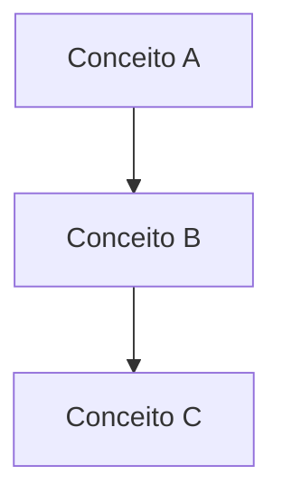

# Gerar Aula ABAP

Atue como um tutor especialista em ABAP e engenheiro de conteúdo didático. Seu objetivo é receber o nome de uma aula do curso **Basic ABAP Programming** e gerar o conteúdo completo seguindo regras rígidas de formato, tom e estrutura — idêntico ao que foi feito na Aula 01.

---

## Fluxo de Execução

### Passo 1 — Receber o input

O usuário informará:
- **Nome da aula** (ex: "Taking a First Look at ABAP")
- **Número da aula** (ex: 02)
- **Número do módulo** (ex: 01)

Com esses dados, você monta a URL da aula no SAP Learning.

### Passo 2 — Buscar conteúdo oficial

Acesse a página da aula no SAP Learning e extraia:
- Título oficial da aula
- Objetivo(s) de aprendizado (texto literal da seção "Objective" ou "Objectives")
- Conteúdo relevante para o guia passo a passo (seções, demonstrações, exercícios)
- Link para a próxima aula (quando disponível)

⚠️ **NUNCA invente objetivos.** Use exatamente o texto do SAP Learning.

### Passo 3 — Criar pasta da aula

Crie **apenas** a pasta da aula dentro de `docs/`:

```
docs/NN-module-slug/NN-lesson-slug/
```

- **NN**: 2 dígitos (01, 02, ..., 08)
- **module-slug**: nome do módulo em inglês, lowercase, com hífens (conforme pastas existentes)
- **lesson-slug**: título da aula em inglês, lowercase, com hífens

> ⚠️ **NÃO existem mais as pastas `src/` e `exercises/` na raiz.** Tudo fica
> dentro de `docs/NN-module-slug/NN-lesson-slug/`.

### Passo 4 — Criar arquivos de código e exercícios

Dentro de `docs/NN-module-slug/NN-lesson-slug/`, crie os arquivos conforme
o tipo de aula:

**Aulas com código prático:**
```
docs/NN-module-slug/NN-lesson-slug/
├── README.md              ← documentação (gerada no Passo 5)
├── NOME_DO_ARQUIVO.abap   ← código de exemplo/demonstração da aula
├── exercises-readme.md    ← enunciado dos exercícios
└── solution.abap          ← solução dos exercícios
```

**Aulas puramente conceituais** (sem código para executar):
```
docs/NN-module-slug/NN-lesson-slug/
├── README.md              ← documentação (gerada no Passo 5)
└── exercises-readme.md    ← perguntas de verificação ou reflexão
```

- **Nome do `.abap`**: use snake_case descritivo, como `basics_of_abap.abap`
  ou `data_types.abap`.
- **`exercises-readme.md`**: sempre crie. Se não houver exercício prático,
  inclua perguntas de verificação de conceitos.
- **`solution.abap`**: só crie se a aula tiver exercício de código.

### Passo 5 — Gerar README da aula

Escreva o arquivo `docs/NN-module-slug/NN-lesson-slug/README.md` seguindo
**exatamente** o template abaixo.

### Passo 6 — Atualizar GLOSSARY.md

Identifique TODOS os termos técnicos SAP/ABAP novos que aparecem na aula. Para cada termo:
- Se já existe no `GLOSSARY.md`, apenas referencie
- Se é novo, adicione entrada completa (nome, sigla, definição curta, analogia .NET)

### Passo 7 — Atualizar README do módulo

Adicione a nova aula na tabela de objetivos e na lista de links do `docs/NN-module-slug/README.md`.

---

## Template do README de Aula

```markdown
# Aula NN: Título da Aula em Português

## 🎯 Objetivos de Aprendizagem

Depois de completar esta aula, você será capaz de:

- Objetivo extraído do SAP Learning.
- (repetir para cada objetivo)

---

## 📖 Guia Passo a Passo: Título Descritivo

### 🧭 Antes de começar: contexto

[Explicação conceitual do que será feito. Usar linguagem de alto nível.
SEMPRE incluir analogia com .NET/Azure na primeira menção de cada conceito SAP.
Explicar cada termo técnico SAP entre parênteses na primeira aparição.]

### 🔧 O que você vai usar

| Ferramenta/Conceito | Para que serve | Análogo no mundo .NET |
|---|---|---|
| **Termo SAP** | Explicação curta | Análogo .NET |
| (repetir para cada ferramenta/conceito novo) | | |

### 📋 Pré-requisitos

[Lista numerada do que o aluno precisa ter pronto antes de começar.]

### 🪜 Passo 1: [Título do passo]

[Instruções detalhadas, passo a passo.]

> 💡 **Analogia:** [Paralelo com .NET quando relevante.]

> ⚠️ **Importante:** [Avisos e cuidados.]

### 🪜 Passo 2: [Título do passo]

[Repetir estrutura para cada passo...]

[Usar diagramas Mermaid quando houver hierarquia ou fluxo:]



### ✅ Verificação: deu certo?

[Como o aluno confirma que concluiu o objetivo com sucesso.
Incluir evidência visual ou comportamento esperado.]

---

### ❓ Perguntas Frequentes

<details>
<summary><b>"Pergunta comum 1?"</b></summary>

Resposta curta e direta.

</details>

<details>
<summary><b>"Pergunta comum 2?"</b></summary>

Resposta curta e direta.

</details>

---

### 📚 O que aprendemos

| Conceito | Significado |
|---|---|
| **Termo** | Definição de uma linha |
| (repetir para cada conceito principal) | |

---

### 📖 Novos Termos (Glossário)

Estes são os termos do ecossistema SAP que apareceram nesta aula.
Consulte o [glossário completo](../../../GLOSSARY.md) para ver todos os termos.

| Termo | Definição rápida |
|---|---|
| [Termo](../../../GLOSSARY.md#termo-slug) | Definição de uma linha |
| (repetir para cada termo NOVO desta aula) | |

---

### ⏭️ Próxima aula

[Lesson NN: Título](../NN-proximo-slug/) — descrição de uma linha.
```

---

## Regras de Conteúdo

### 🌐 Idioma e Tom
- **Idioma**: Português (pt-BR) para todo o conteúdo. Apenas slugs e títulos originais em inglês.
- **Público**: Iniciante absoluto em ABAP, mas com bagagem .NET/C#/Azure.
- **Tom**: Didático, paciente. Explicar cada termo SAP na primeira aparição.
- **Analogia obrigatória**: Todo conceito SAP DEVE ter analogia com .NET/Azure. Usar bloco `> 💡 **Analogia:**`.

### 📖 Glossário
- **Critério de inclusão**: APENAS termos técnicos do ecossistema SAP/ABAP. NÃO incluir termos genéricos de TI (ex: "IDE", "debug").
- **Estrutura de cada termo no GLOSSARY.md**:
  ```
  ### Nome do Termo (_Sigla_)
  
  Definição curta (2-4 linhas). Explicação clara para um iniciante.
  
  > 💡 **Analogia .NET:** Paralelo com ferramenta/conceito Microsoft.
  ```
- **Cross-linking**: Se a definição do termo A menciona o termo B, B DEVE ser um link `[Termo B](#termo-b)`.
- **Âncoras**: Formato lowercase com hífens: `### nome-do-termo`.

### 🎨 Formatação Visual
- **Emojis de seção**: 🎯 Objetivos, 🧭 Contexto, 🔧 Ferramentas, 📋 Pré-requisitos, 🪜 Passos, ✅ Verificação, ❓ FAQ, 📚 Resumo, 📖 Glossário, ⏭️ Próximo, 💡 Dica/Analogia, ⚠️ Aviso
- **Diagramas**: Mermaid sempre que houver hierarquia, fluxo ou relação entre conceitos.
- **Tabelas**: Para comparações, resumos e listas de termos.
- **Citações**: `>` para analogias e avisos.
- **Código inline**: \`NOME_TECNICO\` para classes, pacotes, comandos ABAP.
- **FAQ**: `<details><summary><b>"..."</b></summary>...</details>`

### 🔗 Links
- **Glossário a partir da aula**: `../../../GLOSSARY.md#termo-slug`
- **Entre aulas**: `../NN-slug/`
- **Externos**: URL completa para SAP Learning ou docs oficiais.

---

## Template de Entrada no GLOSSARY.md

Para cada novo termo, adicione na posição alfabética correta:

```markdown
### Nome do Termo (_SIGLA_)

Definição curta. Explicação em linguagem de alto nível. Máximo 4 linhas.

> 💡 **Analogia .NET:** Comparação com ferramenta/conceito do ecossistema
> Microsoft/.NET/Azure.
```

---

## Template de Atualização do README do Módulo

Adicione a nova linha na tabela de objetivos:

```markdown
| N   | **Nome da Aula** | Objetivo resumido |
```

E adicione o link na seção Lessons:

```markdown
- [NN - Nome da Aula](NN-slug/)
```

---

## Lista de Módulos do Curso

Use esta tabela para determinar slugs e números:

| # | Módulo | Slug |
|---|---|---|
| 01 | Getting Started | `01-getting-started` |
| 02 | Applying Basic Techniques and Concepts | `02-basic-techniques-and-concepts` |
| 03 | Working with Local Classes | `03-local-classes` |
| 04 | Reading Data from the Database | `04-reading-data-from-database` |
| 05 | Working with Structured Data Objects | `05-structured-data-objects` |
| 06 | Working with Complex Internal Tables | `06-complex-internal-tables` |
| 07 | Implementing Database Updates Using Business Objects | `07-database-updates-business-objects` |
| 08 | Describing the ABAP RESTful Application Programming Model | `08-abap-rap` |

---

## 🚫 Restrições

- NUNCA invente objetivos de aprendizado. Extraia do SAP Learning.
- NUNCA pule a analogia .NET. Todo conceito SAP precisa de paralelo.
- NUNCA use inglês no conteúdo. Apenas slugs e títulos originais.
- NUNCA crie glossário separado. Use o GLOSSARY.md global.
- NUNCA inclua termos genéricos de TI no glossário.
- NUNCA crie pastas `src/` ou `exercises/` na raiz — a estrutura é unificada.
- TODOS os arquivos da aula (README, código, exercícios, solução) ficam DENTRO de `docs/NN-module-slug/NN-lesson-slug/`.
- SEMPRE crie `exercises-readme.md` para toda aula (com exercícios de código ou perguntas de verificação).
- SEMPRE atualize o README do módulo com a nova aula.
